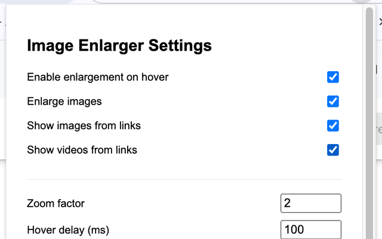

# Image Enlarger Chrome Extension

[English Version](#overview) | [中文版本](#概述)

### Overview

Image Enlarger is a Chrome extension that enhances your browsing experience by allowing you to enlarge images and preview image/video links on hover. With customizable settings, you can tailor the experience to your preferences.

### Features

- **Image Enlargement**: Hover over any image to see an enlarged version
- **Link Preview**: Automatically detect and preview images and videos from links
- **Smart Positioning**: Intelligently positions enlarged content for optimal viewing
- **Customizable Settings**:
  - Adjust zoom factor
  - Set hover delay
  - Choose between cursor-following or fixed position display
  - Set minimum image size to process
  - Exclude specific domains

### Screenshots

*Hovering over a thumbnail shows an enlarged version*

*Customizable settings panel*

### Installation

1. Download the extension from the Chrome Web Store or load it as an unpacked extension
2. Click the extension icon to access settings
3. Customize your preferences as needed

### Usage

- Simply hover over any image to see an enlarged version
- Hover over links to images or videos to preview their content
- Access settings by clicking the extension icon in your browser toolbar

### Settings Explained

- **Enable enlargement on hover**: Master toggle for the extension
- **Enlarge images**: Enable/disable image enlargement
- **Show images from links**: Enable/disable image preview from links
- **Show videos from links**: Enable/disable video preview from links
- **Zoom factor**: How much to enlarge the image (2 = double size)
- **Hover delay**: Time in milliseconds before enlargement appears
- **Display position**: Choose between following cursor or fixed center position
- **Minimum image size**: Smallest image size (in pixels) to process
- **Maximum enlarged size**: Largest size (in pixels) for enlarged images
- **Excluded domains**: List of websites where the extension won't work

### Privacy

This extension works entirely on your device and doesn't collect or transmit any data. No tracking, no ads, just a better browsing experience.

### Contributing

Contributions to improve Image Enlarger are welcome! Here's how you can contribute:

1. Fork the repository
2. Create a feature branch: `git checkout -b new-feature`
3. Commit your changes: `git commit -am 'Add some feature'`
4. Push to the branch: `git push origin new-feature`
5. Submit a pull request

Please make sure to update tests as appropriate and adhere to the existing coding style.

### Development

To set up the development environment:

1. Clone this repository
2. Open Chrome and navigate to `chrome://extensions/`
3. Enable "Developer mode"
4. Click "Load unpacked" and select the project folder
5. Make changes to the code
6. Click the refresh icon on the extension card to see your changes

### Future Enhancements

- Support for more video formats and platforms
- Keyboard shortcuts for toggling the extension
- Image download functionality
- Customizable overlay appearance
- Support for SVG and other vector formats

### License

This project is licensed under the MIT License - see the LICENSE file for details.

---

### 概述

图像放大器是一个Chrome扩展程序，通过允许您在悬停时放大图像和预览图像/视频链接，增强您的浏览体验。通过可自定义的设置，您可以根据自己的喜好定制体验。

### 功能

- **图像放大**：悬停在任何图像上即可查看放大版本
- **链接预览**：自动检测并预览链接中的图像和视频
- **智能定位**：智能定位放大内容以获得最佳视觉效果
- **可自定义设置**：
  - 调整缩放因子
  - 设置悬停延迟
  - 选择跟随光标或固定位置显示
  - 设置要处理的最小图像尺寸
  - 排除特定域名

### 截图展示

*悬停在缩略图上显示放大版本*

*可自定义的设置面板*

### 安装

1. 从Chrome网上应用店下载扩展程序或作为未打包扩展程序加载
2. 点击扩展图标访问设置
3. 根据需要自定义您的偏好设置

### 使用方法

- 只需将鼠标悬停在任何图像上即可查看放大版本
- 将鼠标悬停在图像或视频链接上以预览其内容
- 通过点击浏览器工具栏中的扩展图标访问设置

### 设置说明

- **启用悬停放大**：扩展的主开关
- **放大图像**：启用/禁用图像放大
- **显示链接中的图像**：启用/禁用链接中的图像预览
- **显示链接中的视频**：启用/禁用链接中的视频预览
- **缩放因子**：放大图像的倍数（2 = 双倍大小）
- **悬停延迟**：放大效果出现前的时间（毫秒）
- **显示位置**：选择跟随光标或固定中心位置
- **最小图像尺寸**：要处理的最小图像尺寸（像素）
- **最大放大尺寸**：放大图像的最大尺寸（像素）
- **排除域名**：扩展不会工作的网站列表

### 隐私

此扩展完全在您的设备上运行，不收集或传输任何数据。没有跟踪，没有广告，只有更好的浏览体验。

### 贡献

欢迎为改进图像放大器做出贡献！以下是贡献方式：

1. Fork 这个仓库
2. 创建一个功能分支：`git checkout -b new-feature`
3. 提交您的更改：`git commit -am '添加某功能'`
4. 推送到分支：`git push origin new-feature`
5. 提交拉取请求

请确保适当更新测试并遵守现有的编码风格。

### 开发

要设置开发环境：

1. 克隆此仓库
2. 打开Chrome并导航至`chrome://extensions/`
3. 启用"开发者模式"
4. 点击"加载已解压的扩展程序"并选择项目文件夹
5. 对代码进行更改
6. 点击扩展卡片上的刷新图标以查看更改

### 未来增强

- 支持更多视频格式和平台
- 用于切换扩展的键盘快捷键
- 图像下载功能
- 可自定义的覆盖外观
- 支持SVG和其他矢量格式

### 许可证

本项目采用MIT许可证 - 详情请参阅LICENSE文件。
